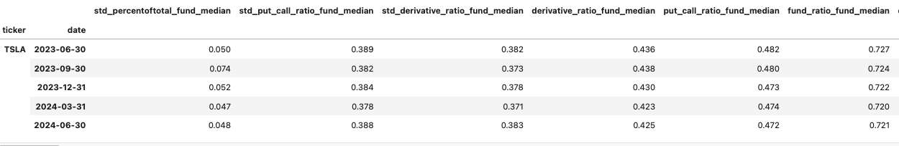

# 🤹‍♂️ Signal Evaluation

### Key Features

* Comprehensive performance analysis
* Risk-adjusted return metrics
* Stress testing capabilities
* Drawdown analysis
* Return distribution analysis
* Signal persistence evaluation

### Usage

To use the Signal Evaluator, you first need to prepare your signal data. The module expects a DataFrame containing your signal values. Once you have your data ready, you can initialize the Signal Evaluator as follows:

```python
import sovai as sov

# Authenticate
sov.token_auth(token="your_authentication_token")

# Prepare your signal data
df_signal = sov.data("your_signal_data_source")

# Initialize the Signal Evaluator
evaluator = df_signal.signal_evaluator()
```

## Available Analyses and Visualizations

### Performance Plot

This visualization helps in understanding the overall effectiveness of the signal and its risk-adjusted performance over time.

```python
evaluator.performance_plot
```

<figure><figcaption></figcaption></figure>

This plot provides a comprehensive view of the signal's performance over time. It includes:

* Cumulative returns of the strategy
* A 95% confidence interval based on random simulations
* A rolling Sharpe ratio on a secondary y-axis

### Signal Decile Plot

This helps in understanding how different levels of the signal correspond to future returns, providing insights into the signal's predictive power across its range.

```python
evaluator.signal_decile_plot
```

<figure><figcaption></figcaption></figure>

This plot breaks down the signal's performance by strength, showing:

* Cumulative returns for each signal decile
* Average Sharpe ratios for each decile

### Stress Test Plot

```python
evaluator.stress_plot
```

<figure><figcaption></figcaption></figure>

This visualization shows how the signal performs during various historical market stress events, helping to assess:

* Strategy robustness during market crises
* Potential for drawdowns during extreme market conditions
* Comparative performance against benchmark during stress periods

### Drawdown Plot

```python
evaluator.drawdown_plot
```

<figure><figcaption></figcaption></figure>

This plot visualizes the drawdowns of the strategy over time, helping to understand:

* Magnitude of historical drawdowns
* Frequency of drawdowns
* Recovery periods

### Return Distribution Plot

This plot helps in understanding the risk profile of the strategy and the likelihood of extreme returns.

```python
evaluator.distribution_plot
```

<figure><figcaption></figcaption></figure>

This histogram shows the distribution of strategy returns, typically including:

* Mean return
* Standard deviation
* Skewness and kurtosis
* Various risk metrics (e.g., VaR, CVaR)

### &#x20;Returns Heatmap

```python
evaluator.returns_heatmap_plot
```

<figure><figcaption></figcaption></figure>

This heatmap displays strategy returns across different months and years, useful for identifying:

* Seasonal patterns in performance
* Consistency of returns over time
* Years or months of outperformance/underperformance

### Signal Autocorrelation Plot

```python
evaluator.signal_correlation_plot
```

<figure><figcaption></figcaption></figure>

This plot shows the autocorrelation of the signal over time, providing insights into:

* Signal persistence
* Potential for mean reversion
* Optimal holding periods

### Portfolio Turnover Plot

```python
evaluator.turnover_plot
```

<figure><figcaption></figcaption></figure>

This visualization depicts portfolio turnover over time, separated into long and short positions. It helps in assessing:

* Trading costs
* Strategy stability
* Potential capacity constraints

### Performance Statistics Table

```python
evaluator.performance_table
```

<figure><figcaption></figcaption></figure>

<figure><figcaption></figcaption></figure>

This comprehensive table presents key performance statistics, including:

* Annualized returns
* Sharpe ratio
* Sortino ratio
* Maximum drawdown
* Calmar ratio
* Other relevant performance indicators

#### 10. Drawdown Analysis Table

```python
evaluator.drawdown_table
```

<figure><figcaption></figcaption></figure>

This table provides detailed information about the worst drawdown periods, including:

* Drawdown magnitude
* Duration of drawdowns
* Recovery times

### Other Core Attributes

The Signal Evaluator also provides access to several core attributes for further analysis:

1. `evaluator.positions`: Initial portfolio holdings derived from the signal
2. `evaluator.rebalance_mask`: Boolean mask indicating rebalancing schedule
3. `evaluator.holdings`: Actual portfolio holdings after applying rebalancing
4. `evaluator.returns`: Returns of the underlying assets
5. `evaluator.position_returns`: Returns of the portfolio positions
6. `evaluator.resampled_returns`: Returns resampled to match rebalancing frequency
7. `evaluator.portfolio_returns`: Aggregate portfolio returns
8. `evaluator.cumulative_returns`: Cumulative performance of the portfolio

