# Weight Optimization

`Tutorials` are the best documentation — [<mark style="color:blue;">`Weight Optimization Tutorial`</mark>](https://colab.research.google.com/github/sovai-research/sovai-public/blob/main/notebooks/studies/Weight%20Optimization.ipynb)

### Key Features

* Multiple optimization strategies
* Comprehensive performance analysis
* Risk-adjusted return metrics
* Portfolio composition visualization
* Drawdown and contribution analysis
* Correlation and clustering analysis
* Daily weight tracking

### Usage

To use the Weight Optimization module, you first need to prepare your dataset. Here's an example of how to set up and run the optimization:

<pre class="language-python"><code class="lang-python">import sovai as sov

# Authenticate
sov.token_auth(token="your_authentication_token")

# Prepare your data
df_price = sov.data("market/closeadj")
df_mega = df_price.select_stocks("mega").date_range("2000-01-01")
df_returns = df_mega.calculate_returns().dropna(axis=1, how="any")

# Select the most uncorrelated stocks
feature_importance = df_returns.importance()
df_select = df_returns[feature_importance["feature"].head(25)]

# Run weight optimization
<a data-footnote-ref href="#user-content-fn-1">portfolio</a> = df_select.weight_optimization()
</code></pre>

## Overall Portfolio Analysis

### **Sharpe Ratio Distribution**

Shows the distribution of Sharpe ratios across different strategies, helping to understand the consistency of risk-adjusted returns.

<pre class="language-python"><code class="lang-python"><a data-footnote-ref href="#user-content-fn-2">portfolio</a>.sharpe_plot
</code></pre>

<figure>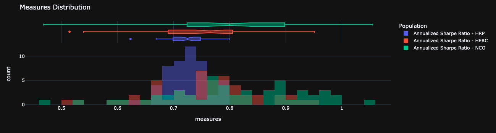<figcaption></figcaption></figure>

### **Cumulative Returns Plot**

Displays the cumulative returns of all portfolio strategies over time, allowing for easy comparison of overall performance.

<pre class="language-python"><code class="lang-python"><a data-footnote-ref href="#user-content-fn-3">portfolio</a>.return_plot
</code></pre>

<figure>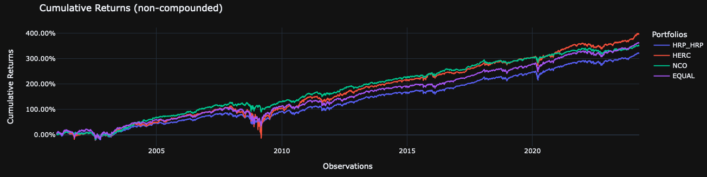<figcaption></figcaption></figure>

### **Overall Composition Plot**

Illustrates the asset allocation of all strategies, allowing for a comparison of how different models allocate capital.

<pre class="language-python"><code class="lang-python"><a data-footnote-ref href="#user-content-fn-4">portfolio</a>.composition_plot
</code></pre>

<figure>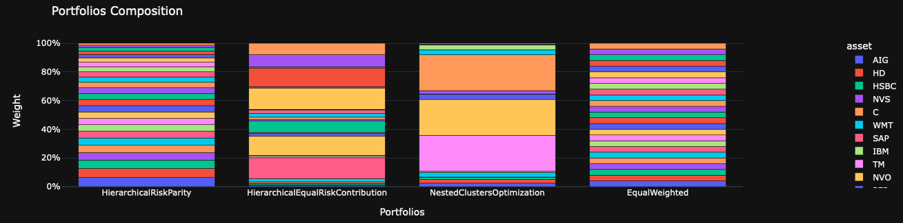<figcaption></figcaption></figure>

### **Best Performing Model**

Identifies the strategy that performed best according to the Sharpe ratio.

<pre class="language-python"><code class="lang-python"><a data-footnote-ref href="#user-content-fn-5">portfolio</a>.best_model
</code></pre>

```
'NCO'
```

### **Performance Summary**

Provides a comprehensive summary of key performance metrics for all strategies, including returns, volatility, Sharpe ratio, and more.

<pre class="language-python"><code class="lang-python"><a data-footnote-ref href="#user-content-fn-6">portfolio</a>.performance_report
</code></pre>

<figure>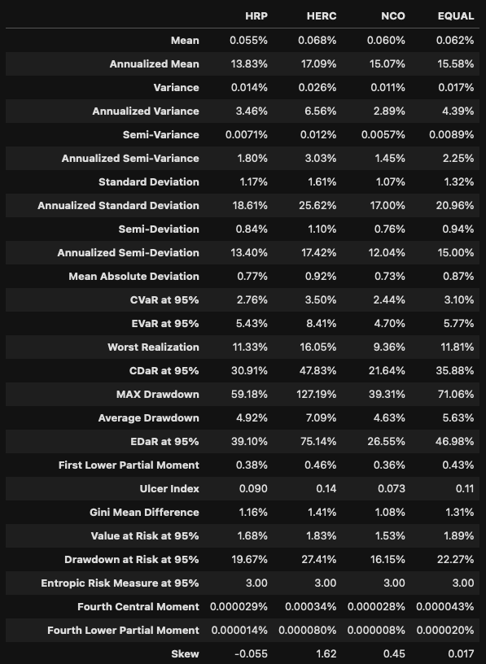<figcaption></figcaption></figure>

## Model-Specific Analysis

For model-specific analysis, replace "model\_name" with the actual model name (e.g., HRP, HERC, NCO, or EQUAL).

### **Cumulative Returns**

<pre class="language-python"><code class="lang-python"><a data-footnote-ref href="#user-content-fn-7">portfolio</a>["model_name"].backtest_plot
</code></pre>

<figure>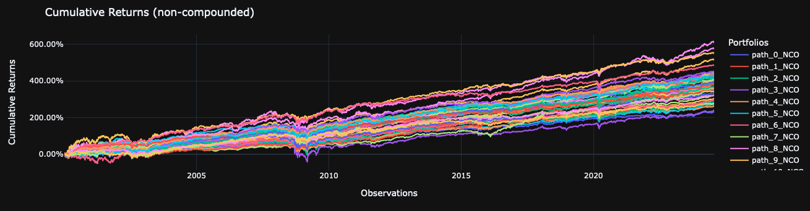<figcaption></figcaption></figure>

Displays the cumulative returns of the specific model over the backtesting period.

### **Backtest Report**

Detailed performance statistics from the backtesting period for the specific model.

<pre class="language-python"><code class="lang-python"><a data-footnote-ref href="#user-content-fn-8">portfolio</a>["model_name"].backtest_report
</code></pre>

<figure>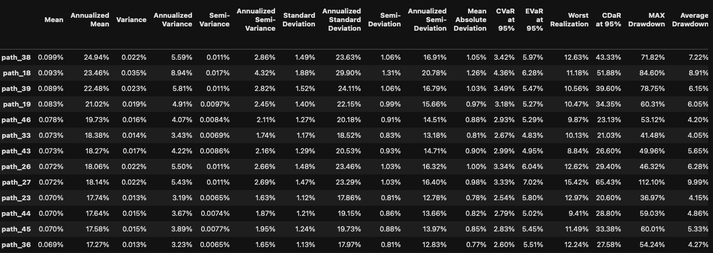<figcaption></figcaption></figure>

### **Rolling Sharpe Ratio**

Visualizes how the Sharpe ratio of the model changes over time, indicating consistency of performance.

<pre class="language-python"><code class="lang-python"><a data-footnote-ref href="#user-content-fn-9">portfolio</a>["model_name"].sharpe_rolling_plot
</code></pre>

<figure>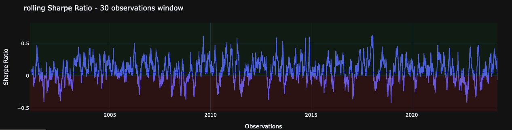<figcaption></figcaption></figure>

### **Model Composition**

Illustrates the asset allocation for the specific model.

<pre class="language-python"><code class="lang-python"><a data-footnote-ref href="#user-content-fn-10">portfolio</a>["model_name"].composition_plot
</code></pre>

<figure>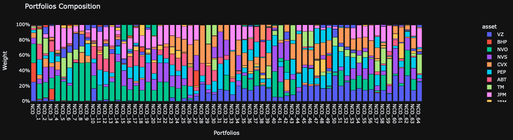<figcaption></figcaption></figure>

### **Drawdown Contribution**

Shows which assets contribute most to the portfolio's drawdowns, helping identify risk sources.

<pre class="language-python"><code class="lang-python"><a data-footnote-ref href="#user-content-fn-11">portfolio</a>["model_name"].drawdown_contribution_plot
</code></pre>

<figure>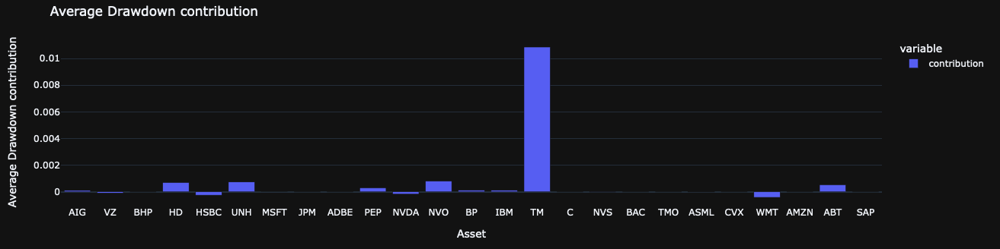<figcaption></figcaption></figure>

### **Sharpe Ratio Contribution**

Indicates which assets contribute most to the portfolio's Sharpe ratio, highlighting return drivers.

<pre class="language-python"><code class="lang-python"><a data-footnote-ref href="#user-content-fn-12">portfolio</a>["model_name"].sharpe_contribution_plot
</code></pre>

<figure>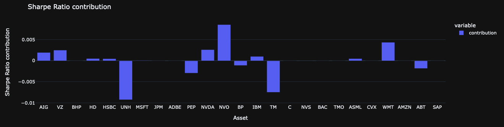<figcaption></figcaption></figure>

### **Correlation Heatmap**

Displays the correlation structure of assets used in the model (not available for EQUAL).

<pre class="language-python"><code class="lang-python"><a data-footnote-ref href="#user-content-fn-13">portfolio</a>["model_name"].heatmap_plot
</code></pre>

<figure>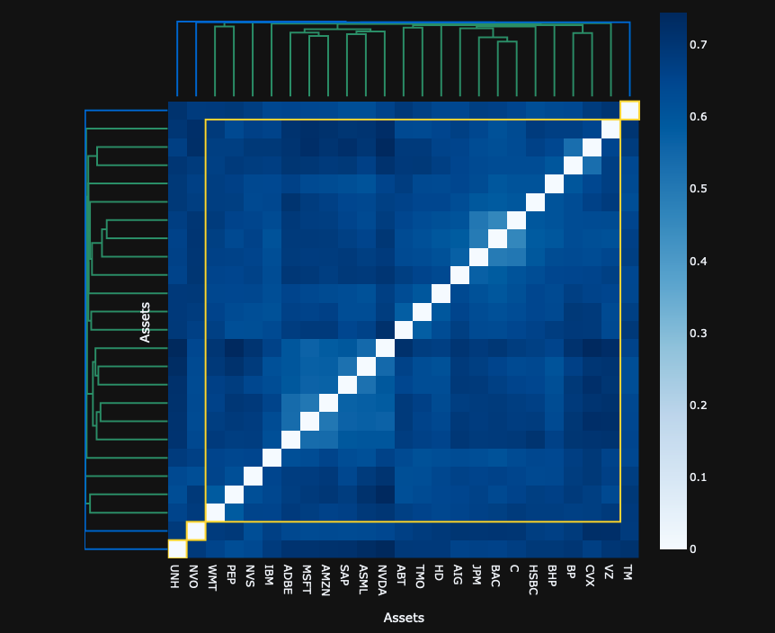<figcaption></figcaption></figure>

### **Clustering Dendrogram**

Visualizes the hierarchical clustering of assets used in the model (not available for EQUAL).

<pre class="language-python"><code class="lang-python"><a data-footnote-ref href="#user-content-fn-14">portfolio</a>["model_name"].cluster_plot
</code></pre>

<figure>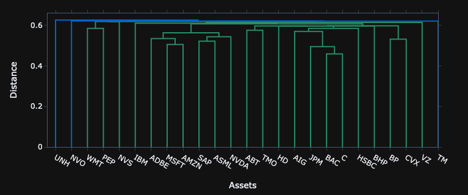<figcaption></figcaption></figure>

### **Current Recommended Allocation**

Provides the model's most recent recommended asset allocation.

<pre class="language-python"><code class="lang-python"><a data-footnote-ref href="#user-content-fn-15">portfolio</a>["model_name"].recommended_allocation
</code></pre>

<figure>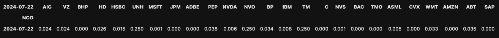<figcaption></figcaption></figure>

### **Sharpe Ratio Distribution**

Shows the distribution of Sharpe ratio helping to understand the consistency of risk-adjusted returns.

<pre class="language-python"><code class="lang-python"><a data-footnote-ref href="#user-content-fn-16">portfolio</a>["model_name"].recommended_allocation
</code></pre>

<figure>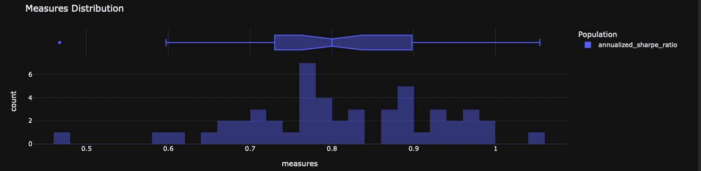<figcaption></figcaption></figure>

### **Daily Weights**

Shows how the model's asset allocation changes day-by-day over the backtesting period.

<pre class="language-python"><code class="lang-python"><a data-footnote-ref href="#user-content-fn-17">portfolio</a>["model_name"].daily_weights
</code></pre>

<figure>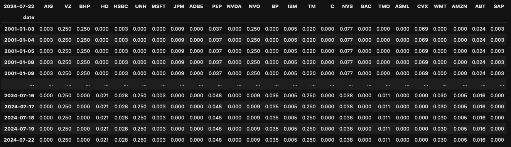<figcaption></figcaption></figure>

[^1]: class module

[^2]: class module

[^3]: class module

[^4]: class module

[^5]: class module

[^6]: class module

[^7]: class module

[^8]: class module

[^9]: class module

[^10]: class module

[^11]: class module

[^12]: class module

[^13]: class module

[^14]: class module

[^15]: class module

[^16]: class module

[^17]: class module
