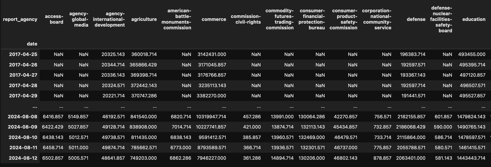

# Government Traffic

`Tutorials` are the best documentation — [<mark style="color:blue;">`Government Traffic Analysis Tutorial`</mark>](https://colab.research.google.com/github/sovai-research/sovai-public/blob/main/notebooks/datasets/Government%20Internet.ipynb)

## Description

This dataset provides web traffic data for U.S. government agencies and domains, offering insights into public engagement with government websites.&#x20;

It enables analysis of traffic trends, inter-agency comparisons, and patterns of citizen interaction with government online resources.

## Data Access

```python
import sovai as sov
sov.token_auth(token="your_token_here")

# Agency-level traffic data
df_agencies = sov.data("government/traffic/agencies")

# Domain-level traffic data
df_domains = sov.data("government/traffic/domains")
```

<figure><figcaption></figcaption></figure>

### Dataset Contents

1. **Agency Traffic (df\_agencies)**
   * Provides traffic data aggregated at the agency level.
   * Allows for high-level analysis of government agency website usage.
2. **Domain Traffic (df\_domains)**
   * Offers more granular data on traffic to specific government domains.
   * Enables analysis of individual website performance within agencies.

### Analysis Capabilities

* Time series analysis of traffic patterns
* Correlation analysis between different domains or agencies
* Calculation of statistical measures like coefficient of variation
* Filtering for specific types of domains (e.g., embassies)

### Example Analyses

1.  Plotting agency-level traffic:

    ```python
    df_agencies.plot()
    ```
2.  Analyzing embassy website traffic:

    ```python
    df_embassy = df_domains.loc[:, df_domains.columns.str.contains('embassy', case=False)]
    df_embassy.plot()
    ```
3.  Correlation analysis:

    ```python
    df_embassy.corr()
    ```
4.  Advanced statistics (e.g., coefficient of variation):

    ```python
    cv = df_embassy.std().div(df_embassy.mean()).sort_values()
    ```

This dataset is valuable for understanding government web presence, analyzing public engagement with government resources, and identifying trends in how citizens interact with government websites.
