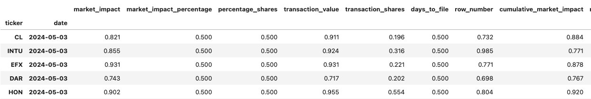

# Insider Flow Prediction


Data is updated every Friday after market closes US ET time.


`Tutorials` are the best documentation — [<mark style="color:blue;">`Insider Flow Prediction Tutorial`</mark>](https://colab.research.google.com/github/sovai-research/sovai-public/blob/main/notebooks/datasets/Insider%20Trading.ipynb)

<table data-column-title-hidden data-view="cards"><thead><tr><th>Category</th><th>Details</th></tr></thead><tbody><tr><td><strong>Input Datasets</strong></td><td>Insider Filings, Market Data</td></tr><tr><td><strong>Models Used</strong></td><td>Machine Learning (Gradient Boost)</td></tr><tr><td><strong>Model Outputs</strong></td><td>Percentile Outputs (Relative)</td></tr></tbody></table>

## Description

This dataset provides comprehensive analysis of insider trading behaviors, including metrics on transaction types, market impact, ownership dynamics, and trading patterns.&#x20;

It offers investors and regulators valuable insights into insider trading strategies, market effects, and potential signaling, enabling more informed decision-making and risk assessment in the context of insider activities.

## Data Access

#### Latest Data

```python
import sovai as sov
df_insider = sov.data("insider/trading")
```

<figure><figcaption></figcaption></figure>

#### All Data

This data is around 1GB if you download the entire dataset.

```python
import sovai as sov
df_insider = sov.data("insider/trading", full_history=True)
```

<figure><figcaption></figcaption></figure>

#### Filtered Dataset

```python
import sovai as sov
df_insider = sov.data("insider/trading", start_date="2004-04-30", tickers=["MSFT"])
```

## Plots

### Percentile Progression

```python
import sovai as sov
sov.plot("insider", chart_type="percentile", ticker="AAPL")
```

<figure><figcaption></figcaption></figure>

### Insider Flow Prediction

```python
import sovai as sov
sov.plot("insider", chart_type="prediction")
```

<figure><figcaption></figcaption></figure>

### Grouped Plot

```python
import sovai as sov
sov.plot("insider", chart_type="flows")
```

<figure><figcaption></figcaption></figure>

<figure><figcaption></figcaption></figure>

## Data Dictionary

| Column Name                                                  | Description                                                                                                         |
| ------------------------------------------------------------ | ------------------------------------------------------------------------------------------------------------------- |
| `ticker`                                                     | Stock ticker symbol associated with the transaction.                                                                |
| `date`                                                       | Date when the transaction was reported.                                                                             |
| `market_impact`                                              | Sum of the effect of all transactions on the market value.                                                          |
| `market_impact_percentage`                                   | Mean impact of transactions as a percentage of the transaction value.                                               |
| `percentage_shares`                                          | Average portion of shares transacted relative to total shares outstanding.                                          |
| `transaction_value`                                          | Total value of the transactions.                                                                                    |
| `transaction_shares`                                         | Total number of shares involved in the transactions.                                                                |
| `days_to_file`                                               | Average number of days between the transaction and filing dates.                                                    |
| `row_number`                                                 | Count of transactions within the dataset.                                                                           |
| `cumulative_market_impact`                                   | Aggregate impact of transactions over time (not directly computed in the provided code but implied).                |
| `relative_transaction_size`                                  | Size of a transaction relative to other transactions, combining absolute ratios of shares and values.               |
| `holding_period`                                             | Average time between the acquisition and sale of stock.                                                             |
| `sale_to_purchase_ratio`                                     | Ratio of the sum of sales to purchases by absolute value.                                                           |
| `holding_period_pert`                                        | Perturbation or change in holding period (calculated as a percentage change or variation).                          |
| `sale_to_purchase_ratio_pert`                                | Variability or percentage change in the sale-to-purchase ratio.                                                     |
| `derivative_nonderivative_value_abs_ratio`                   | Absolute ratio comparing values of derivative and non-derivative transactions.                                      |
| `long_term_alignment_ratio_relativesize_abs_ratio`           | Ratio of long-term alignment (options granted) to relative transaction size.                                        |
| `relative_transaction_size_pert`                             | Variability in the size of a transaction relative to others.                                                        |
| `derivative_nonderivative_impact_abs_ratio`                  | Absolute ratio of market impact between derivative and non-derivative transactions.                                 |
| `tenpercent_nintypercent_impactperc_net_ratio`               | Net ratio of market impact percentage between entities owning ten percent and others.                               |
| `none_to_manager_shares_net_ratio`                           | Net ratio of shares held by non-managers to managers.                                                               |
| `tenpercent_nintypercent_percshares_abs_ratio`               | Absolute ratio of percentage shares held by ten percent owners to others.                                           |
| `direct_indirect_value_net_ratio_pert`                       | Variability in the net ratio of transaction values between direct and indirect ownership.                           |
| `direct_indirect_insiderscore_abs_ratio`                     | Absolute ratio of insider scores for direct versus indirect transactions.                                           |
| `director_officer_impactperc_net_ratio`                      | Net ratio of market impact percentage between directors and officers.                                               |
| `director_officer_shares_net_ratio`                          | Net ratio of shares held by directors to officers.                                                                  |
| `director_officer_occurrences_abs_ratio`                     | Absolute ratio of transaction occurrences between directors and officers.                                           |
| `both_to_all_value_net_ratio`                                | Net ratio of transaction values for individuals with dual roles (both director and officer) compared to all others. |
| `both_to_all_percshares_abs_ratio`                           | Absolute ratio of percentage shares held by individuals with dual roles compared to all others.                     |
| `none_to_manager_percshares_abs_ratio`                       | Absolute ratio of percentage shares held by non-managers to managers.                                               |
| `sale_purchase_ratio_impactperc_abs_ratio_pert`              | Variability in the absolute ratio of market impact percentage between sales and purchases.                          |
| `sale_purchase_ratio_insiderscore_abs_ratio`                 | Absolute ratio of insider scores between sales and purchases.                                                       |
| `willing_acquisitions_ratio_occurrences_abs_ratio`           | Absolute ratio of occurrences of willing acquisitions compared to other transaction types.                          |
| `liquidity_situation_ratio_impact_abs_ratio`                 | Absolute ratio of market impact for transactions related to liquidity situations.                                   |
| `liquidity_situation_ratio_percshares_abs_ratio`             | Absolute ratio of percentage shares involved in liquidity-related transactions.                                     |
| `sale_press_impactperc_director_to_officer_net_ratio_pert`   | Variability in net ratio of market impact percentage from sales pressure between directors and officers.            |
| `sale_press_shares_director_to_officer_net_ratio_pert`       | Variability in net ratio of shares involved in sales pressure between directors and officers.                       |
| `sale_press_impactperc_director_to_officer_abs_ratio_pert`   | Variability in the absolute ratio of market impact percentage from sales pressure between directors and officers.   |
| `sale_press_value_director_to_officer_abs_ratio`             | Absolute ratio of transaction values under sales pressure from directors to officers.                               |
| `sale_press_impact_ten_ninety_net_ratio`                     | Net ratio of market impact for transactions involving top ten percent owners versus others.                         |
| `sale_press_percshares_ten_ninety_net_ratio`                 | Net ratio of percentage shares involved in transactions for top ten percent owners versus others.                   |
| `sale_press_impact_ten_ninety_abs_ratio`                     | Absolute ratio of market impact for transactions involving top ten percent owners versus others.                    |
| `sale_press_insiderscore_ten_ninety_abs_ratio`               | Absolute ratio of insider scores for transactions involving top ten percent owners versus others.                   |
| `sale_press_impact_direct_to_indirect_net_ratio`             | Net ratio of market impact between direct and indirect sales pressure.                                              |
| `sale_press_percshares_direct_to_indirect_net_ratio_pert`    | Variability in net ratio of percentage shares under direct versus indirect sales pressure.                          |
| `sale_press_impactperc_direct_to_indirect_abs_ratio_pert`    | Variability in the absolute ratio of market impact percentage under direct versus indirect sales pressure.          |
| `sale_press_relativesize_direct_to_indirect_abs_ratio`       | Absolute ratio of relative transaction size under direct versus indirect sales pressure.                            |
| `row_number_pert`                                            | Variability or percentage change in the count of transactions.                                                      |
| `derivative_nonderivative_value_net_ratio_pert`              | Variability in the net ratio of values between derivative and non-derivative transactions.                          |
| `derivative_nonderivative_occurrences_abs_ratio_pert`        | Variability in the absolute ratio of occurrences between derivative and non-derivative transactions.                |
| `tenpercent_nintypercent_impact_net_ratio_pert`              | Variability in net ratio of market impact between ten percent owners and others.                                    |
| `tenpercent_nintypercent_percshares_net_ratio_pert`          | Variability in net ratio of percentage shares between ten percent owners and others.                                |
| `tenpercent_nintypercent_value_net_ratio_pert`               | Variability in net ratio of transaction values between ten percent owners and others.                               |
| `tenpercent_nintypercent_percshares_abs_ratio_pert`          | Variability in absolute ratio of percentage shares between ten percent owners and others.                           |
| `direct_indirect_percshares_abs_ratio_pert`                  | Variability in absolute ratio of percentage shares between direct and indirect ownership.                           |
| `director_officer_impact_net_ratio_pert`                     | Variability in net ratio of market impact between directors and officers.                                           |
| `director_officer_percshares_abs_ratio_pert`                 | Variability in absolute ratio of percentage shares between directors and officers.                                  |
| `both_to_all_impact_net_ratio_pert`                          | Variability in net ratio of market impact between dual-role individuals and others.                                 |
| `both_to_all_percshares_abs_ratio_pert`                      | Variability in absolute ratio of percentage shares between dual-role individuals and others.                        |
| `none_to_manager_percshares_abs_ratio_pert`                  | Variability in absolute ratio of percentage shares between non-managers and managers.                               |
| `sale_purchase_ratio_value_abs_ratio_pert`                   | Variability in absolute ratio of transaction values between sales and purchases.                                    |
| `willing_acquisitions_ratio_occurrences_abs_ratio_pert`      | Variability in absolute ratio of occurrences in willing acquisitions.                                               |
| `long_term_alignment_ratio_occurrences_abs_ratio_pert`       | Variability in absolute ratio of occurrences related to long-term alignment transactions.                           |
| `liquidity_situation_ratio_value_abs_ratio_pert`             | Variability in absolute ratio of transaction values in liquidity situations.                                        |
| `sale_press_relativesize_director_to_officer_abs_ratio_pert` | Variability in absolute ratio of relative transaction size under director to officer sales pressure.                |
| `sale_press_value_ten_ninety_net_ratio_pert`                 | Variability in net ratio of transaction values for top ten percent owners versus others.                            |
| `sale_press_impact_ten_ninety_abs_ratio_pert`                | Variability in absolute ratio of market impact for top ten percent owners versus others.                            |
| `sale_press_occurrences_ten_ninety_abs_ratio_pert`           | Variability in absolute ratio of occurrences for top ten percent owners versus others.                              |
| `sale_press_impact_direct_to_indirect_net_ratio_pert`        | Variability in net ratio of market impact under direct versus indirect sales pressure.                              |
| `sale_press_occurrences_direct_to_indirect_abs_ratio_pert`   | Variability in absolute ratio of occurrences under direct versus indirect sales pressure.                           |
| `flow_prediction`                                            | Predicted transaction flow based on analysis (not directly computed in the provided code but implied).              |

### Feature Descriptions

1. Derivative and Non-Derivative Transaction Metrics (Columns 1-4)
   * Purpose: These metrics provide insights into the use of derivative and non-derivative instruments in insider transactions.
   * Usage: Investors can assess the complexity and risk associated with insider trading strategies.
2. Ownership Dynamics Metrics (Columns 5-12)
   * Purpose: These metrics track the ownership patterns and concentrations among insiders, such as directors, officers, and 10% owners.
   * Usage: Useful for identifying potential conflicts of interest and assessing the alignment of insider interests with the company.
3. Transaction Type Metrics (Columns 13-18)
   * Purpose: These metrics analyze the types of transactions, such as purchases, sales, and acquisitions, and their impact on the market.
   * Usage: Investors can evaluate the motivations behind insider transactions and their potential signaling effect.
4. Sale Pressure Metrics (Columns 19-30)
   * Purpose: These metrics focus on the impact of insider sales and the pressure they exert on the market.
   * Usage: Essential for understanding the liquidity and price dynamics surrounding insider sales.
5. Variability and Perturbation Metrics (Columns 31-50)
   * Purpose: These metrics measure the variability and percentage changes in various aspects of insider transactions.
   * Usage: Useful for assessing the stability and predictability of insider trading patterns.
6. Key Transaction Details
   * `ticker`: Stock ticker symbol associated with the insider transaction.
   * `date`: Date when the insider transaction was reported.
   * `market_impact`: Sum of the effect of all insider transactions on the market value.
   * `market_impact_percentage`: Mean impact as a percentage of the transaction value.
   * `percentage_shares`: APortio transacted by insiders relative to total shares outstanding.
   * `transaction_value`: Total value of the insider transactions.
   * `transaction_shares`: Total number of shares involved in the insider transactions.
   * `days_to_file`: Average number of days between the insider transaction and filing dates.
   * `row_number`: Count of insider transactions within the dataset.
   * `cumulative_market_impact`: Aggregate impact of insider transactions over time.
   * `holding_period`: Average time between the acquisition and sale of stock by insiders.
   * `sale_to_purchase_ratio`: Ratio of the sum of insider sales to purchases
   * `holding_period_pert`: Perturbation or change in the holding period of insiders.
   * `sale_to_purchase_ratio_pert`: Change in the sale-to-purchase ratio of insiders.
   * `flow_prediction`: Predicted transaction flow from insider trading patterns.

## Use Cases

This dataset provides a comprehensive analysis of insider trading behaviors, strategies, and portfolio dynamics. It covers various aspects like transaction ratios, market impact metrics, ownership dynamics, and more. The data is designed to assist investors and regulators in understanding insider trading patterns, evaluating the impact of insider transactions, and making informed decisions.Use

* Market Impact Analysis: Understand the impact of insider transactions on market prices and liquidity.
* Risk Assessment: Evaluate the risk profiles of different insider trading strategies and behaviors.
* Investment Decision Making: Utilize insider trading data to make informed investment decisions.

***
