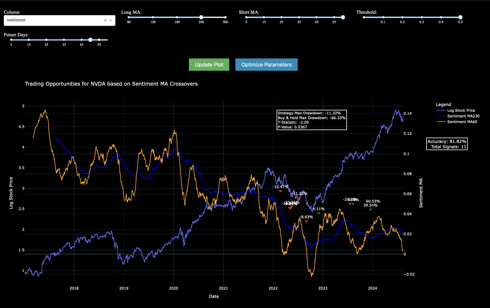

# News Sentiment


Data is updated quarterly as data arrives after market close US-EST time.


`Tutorials` are the best documentation — [<mark style="color:blue;">`News Sentiment Analaysis Tutorial`</mark>](https://colab.research.google.com/github/sovai-research/sovai-public/blob/main/notebooks/datasets/News.ipynb)

<table data-column-title-hidden data-view="cards"><thead><tr><th>Category</th><th>Details</th></tr></thead><tbody><tr><td><strong>Input Datasets</strong></td><td>News Scrapers, Public Event Data</td></tr><tr><td><strong>Models Used</strong></td><td>Fuzzy Matching</td></tr><tr><td><strong>Model Outputs</strong></td><td>Sentiment Scores</td></tr></tbody></table>

## Description

This dataset provides comprehensive news sentiment analysis, offering ticker-matched and theme-matched data on various aspects of news coverage.&#x20;

It includes metrics on sentiment, tone, polarity, and article count, enabling investors and analysts to gauge public perception and potential market impacts of news.

## Data Access

#### Sentiment Data - All Data

```python
from sovai import sov
sov.data("news/sentiment", full_histor=True)
```

#### Sentiment Data - Latest Data

```python
from sovai import sov
sov.data("news/sentiment", full_history=True)
```

#### Sentiment Data -Filtered Dataset

```python
from sovai import sov
df_news = sov.data("news/sentiment", start_date="2017-03-30", tickers=["MSFT","TSLA"])
```

As you have done for `sentiment` above you can do for news `tone`, `polarity`, `activeness` etc.&#x20;

### All Variations

```python
from sovai import sov

# Sentiment Dataset
df_sentiment = sov.data("news/sentiment")
# Provides sentiment scores for news articles, helping gauge the overall emotional tone of news coverage.

# Tone Dataset
df_tone = sov.data("news/tone")
# Offers insights into the overall tone of news articles, differentiating between neutral, positive, or negative coverage.

# Positive Sentiment Dataset
df_positive = sov.data("news/positive")
# Focuses specifically on positive sentiments expressed in news articles.

# Negative Sentiment Dataset
df_negative = sov.data("news/negative")
# Provides information on negative sentiments in news articles, valuable for risk assessment.

# Polarity Dataset
df_polarity = sov.data("news/polarity")
# Measures how polarizing news coverage is, indicating how divisive or controversial certain topics or entities are.

# Match Quality Dataset
df_match = sov.data("news/match_quality")
# Assesses the quality of matches between news articles and specific entities or topics.

# Pronouns Dataset
df_pronouns = sov.data("news/pronouns")
# Analyzes the use of pronouns in news articles.

# Activeness Dataset
df_activeness = sov.data("news/activeness")
# Measures the level of activity or dynamism in news coverage.

# Associated People Dataset
df_associated_people = sov.data("news/associated_people")
# Tracks individuals mentioned in association with specific entities or topics.

# Article Count Dataset
df_article_count = sov.data("news/article_count")
# Provides data on the volume of articles related to specific topics or entities.

# Associated Companies Dataset
df_associated_companies = sov.data("news/associated_companies")
# Tracks companies mentioned in association with specific entities or topics in news articles.
```


### Themed Sentiment

**df\_sentiment\_score** = `sov.data("news/sentiment_score")` Measures **emotional tone** of news articles. **Positive scores**: favorable news; **Negative scores**: unfavorable news.

```python
from sovai import sov
df_sentiment_score = sov.data("news/sentiment_score")
```

<figure><figcaption></figcaption></figure>

**df\_polarity\_score** = `sov.data("news/polarity_score")` Gauges **opinion intensity** in news. **Higher scores**: stronger opinions; **Lower scores**: more neutral reporting.

```python
from sovai import sov
df_polarity_score = sov.data("news/polarity_score")
```


**df\_topic** = `sov.data("news/topic_probability")` Indicates **topic prevalence** in news. **Higher values**: more frequently discussed topics.

All use various statistical measures (mean, median, etc.) across financial/economic topics over time.

```python
from sovai import sov
df_topic = sov.data("news/topic_probability")
```

### Vizualisations

#### Strategy

```python
from sovai import sov
sov.plot("news", chart_type="strategy", ticker='NVDA')
```

<figure><figcaption></figcaption></figure>

#### Econometrics

```python
from sovai import sov
sov.report("news", report_type="econometric")
```

<figure><figcaption></figcaption></figure>

#### Analysis

```python
from sovai import sov

sov.plot("news", chart_type="analysis")
```

<figure><figcaption></figcaption></figure>


## Data Dictionary

<table><thead><tr><th width="170">Feature Name</th><th width="364">Description</th><th width="100">Type</th><th>Example</th></tr></thead><tbody><tr><td>match_quality</td><td>Quality score of the match between the article and the entity, indicating the relevance and accuracy of the match.</td><td>float</td><td>99.75</td></tr><tr><td>within_article</td><td>Number of mentions of the entity within the article, indicating the focus on the entity in the article's content.</td><td>int</td><td>2</td></tr><tr><td>relevance</td><td>The average salience of the entity across the articles, indicating the importance or prominence of the entity.</td><td>float</td><td>0.022049</td></tr><tr><td>magnitude</td><td>A measure of the intensity or strength of the sentiment expressed in the article.</td><td>float</td><td>18.203125</td></tr><tr><td>sentiment</td><td>A score representing the overall sentiment (positive or negative) of the article.</td><td>float</td><td>0.054504</td></tr><tr><td>article_count</td><td>The total number of articles associated with the entity, indicating the level of media attention or coverage.</td><td>int</td><td>1666</td></tr><tr><td>associated_people</td><td>Count of unique people mentioned in the context of the entity, reflecting its association with various individuals.</td><td>int</td><td>143</td></tr><tr><td>associated_companies</td><td>Count of unique companies mentioned in relation to the entity, indicating its business connections.</td><td>int</td><td>287</td></tr><tr><td>tone</td><td>The overall tone of the article, derived from a textual analysis of its content.</td><td>float</td><td>0.237061</td></tr><tr><td>positive</td><td>The score quantifying the positive sentiments expressed in the article.</td><td>float</td><td>2.828125</td></tr><tr><td>negative</td><td>The score quantifying the negative sentiments expressed in the article.</td><td>float</td><td>2.591797</td></tr><tr><td>polarity</td><td>The degree of polarity in the sentiment, indicating the extent of opinionated content.</td><td>float</td><td>5.421875</td></tr><tr><td>activeness</td><td>A measure of the dynamism in the language used, possibly indicating the urgency of the article.</td><td>float</td><td>22.031250</td></tr><tr><td>pronouns</td><td>The count of pronouns used in the article, indicative of the narrative style or subject focus.</td><td>float</td><td>0.995117</td></tr><tr><td>word_count</td><td>The total number of words in the article, giving an indication of its length or detail.</td><td>int</td><td>1084</td></tr></tbody></table>

## Use Case

This dataset provides a comprehensive analysis of various entities (such as companies and individuals) based on their media coverage and associated articles. It's designed to assist investors in understanding the market sentiment, media focus, and the overall perception of entities in which they might be interested. The data is extracted and processed from a wide range of articles, ensuring a broad and in-depth view of each entity.

This dataset is an invaluable resource for investors seeking to gauge public perception, media sentiment, and the prominence of entities in the news. It can be used for:

* Sentiment analysis to understand the market mood.
* Identifying trends in media coverage related to specific entities.
* Assessing the impact of news on stock performance.
* Conducting peer comparison based on media presence and sentiment.

***
