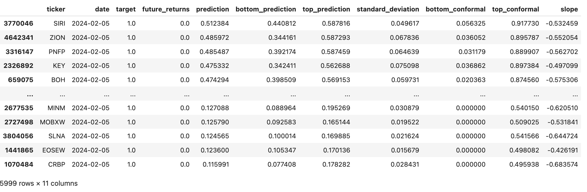
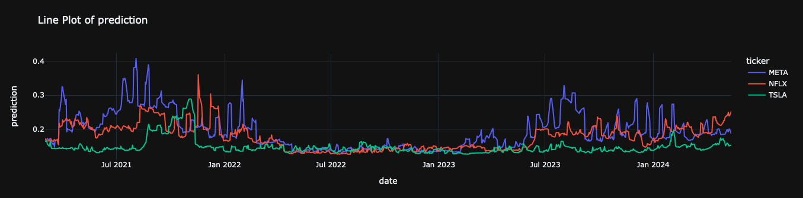
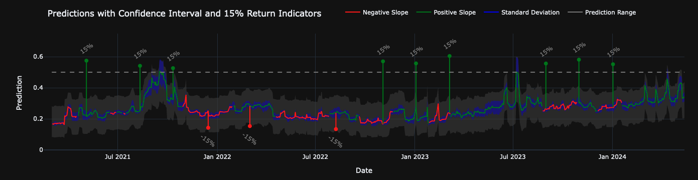
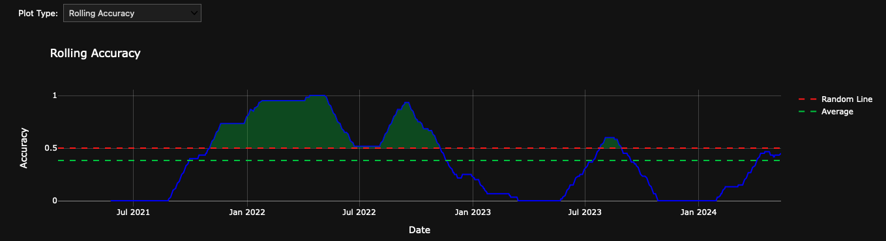

# Price Breakout


Daily predictions arrive between 11 pm - 4 am before market open in the US for 13,000+ stocks.


`Tutorials` are the best documentation — [<mark style="color:blue;">`Price Breakout Prediction Tutorial`</mark>](https://colab.research.google.com/github/sovai-research/sovai-public/blob/main/notebooks/datasets/Breakout%20Prediction.ipynb)

<table data-column-title-hidden data-view="cards"><thead><tr><th>Category</th><th>Details</th></tr></thead><tbody><tr><td>Input Datasets</td><td>Historical Stock Prices, Trading Volumes, Technical Indicators, Order Book.</td></tr><tr><td>Models Used</td><td>Classification Algorithms, Regression Models, Conformal Predictors</td></tr><tr><td>Model Outputs</td><td>Price Movement Predictions, Probability Scores, Confidence Intervals</td></tr></tbody></table>

## Description

This datasets identifies potential price breakout stocks over the next 30-60 days for US Equities. This dataset provides daily predictions of upward price breakouts for over 13,000 US equities.&#x20;

The accuracy is around 65% and ROC-AUC of 68%, it is one of the most accurate breakout models on the market. It is retrained on a weekly basis.&#x20;

Several machine learning models are trained using the prepared dataset:

* **Calibrated Classifier**: A classification model trained on the engineered features to predict the binary target.
* **Proprietory Regressor**: A proprietory regression model is used to predict the probability of a price increase.
* **Conformal Regressor**: Used to provide calibrated confidence intervals around the predictions, offering an additional measure of uncertainty.

## Data Access

### Retrieving Data

#### Latest Data

```python
from sovai import sov
df_breakout = sov.data("breakout")
```

<figure><figcaption></figcaption></figure>

#### Full history

```python
from sovai import sov
df_breakout = sov.data("breakout", full_history=True)
```

#### Specific Ticker

```python
df_msft = sov.data("breakout", tickers=["MSFT"])
```

## Plots

### **Line Predictions**

```python
df_breakout.plot_line(tickers=["TSLA", "META", "NFLX"])
```

<figure><figcaption></figcaption></figure>

### Breakout Predictions

Visualize breakout predictions using the SDK's plotting capabilities:

```python
sov.plot("breakout", chart_type="predictions", df=df_msft)
```

<figure><figcaption></figcaption></figure>

### Prediction Accuracy

Assess the accuracy of breakout predictions:

```python
sov.plot("breakout", chart_type="accuracy", df=df_msft)
```

<figure><figcaption></figcaption></figure>

## Data Dictionary

<table><thead><tr><th width="237">Column</th><th>Description</th><th>Type</th><th>Example</th></tr></thead><tbody><tr><td><code>ticker</code></td><td>Stock ticker symbol.</td><td>object</td><td>"AAPL"</td></tr><tr><td><code>date</code></td><td>Date when the data was recorded.</td><td>datetime64[ns]</td><td>2023-09-30</td></tr><tr><td><code>target</code></td><td>Target variable for predictions.</td><td>float64</td><td>0.05</td></tr><tr><td><code>future_returns</code></td><td>Future returns of the stock.</td><td>float32</td><td>0.10</td></tr><tr><td><code>prediction</code></td><td>Predicted probability from the model.</td><td>float64</td><td>1.25</td></tr><tr><td><code>bottom_prediction</code></td><td>Lower bound of the prediction interval.</td><td>float64</td><td>1.20</td></tr><tr><td><code>top_prediction</code></td><td>Upper bound of the prediction interval.</td><td>float64</td><td>1.30</td></tr><tr><td><code>standard_deviation</code></td><td>Standard deviation of the predictions.</td><td>float64</td><td>0.02</td></tr><tr><td><code>bottom_conformal</code></td><td>Lower bound of the conformal prediction interval.</td><td>float64</td><td>1.18</td></tr><tr><td><code>top_conformal</code></td><td>Upper bound of the conformal prediction interval.</td><td>float64</td><td>1.32</td></tr><tr><td><code>slope</code></td><td>Slope derived from the rolling regression of predictions over a window.</td><td>float64</td><td>0.003</td></tr></tbody></table>

***

## Use Case

Understood. I'll focus on the use cases that would be most relevant to professional investors. Here's the refined list:

• Portfolio optimization:

* Identify potential new additions to diversified stock portfolios
* Rebalance existing holdings based on breakout predictions

• Risk management:

* Use confidence intervals and standard deviations to assess potential downside risk
* Implement more precise hedging strategies based on predicted price movements

• Sector and market analysis:

* Identify trends across industry sectors or the broader market
* Compare breakout potentials across different stock categories (e.g., large-cap vs. small-cap)

• Market timing:

* Use aggregate predictions across multiple stocks to gauge overall market sentiment
* Time entry and exit points for broader market positions
