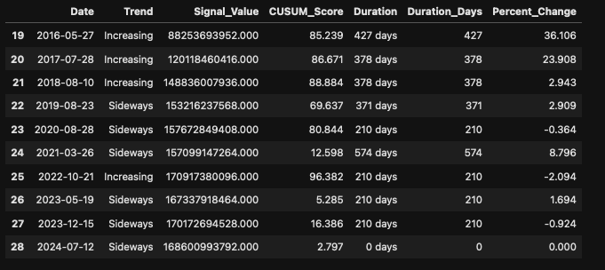
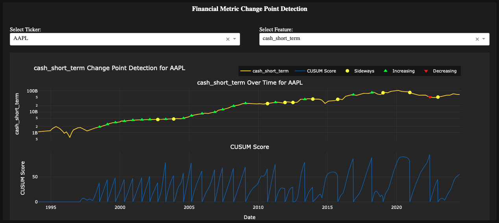
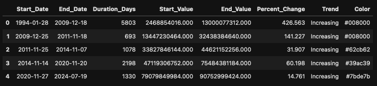
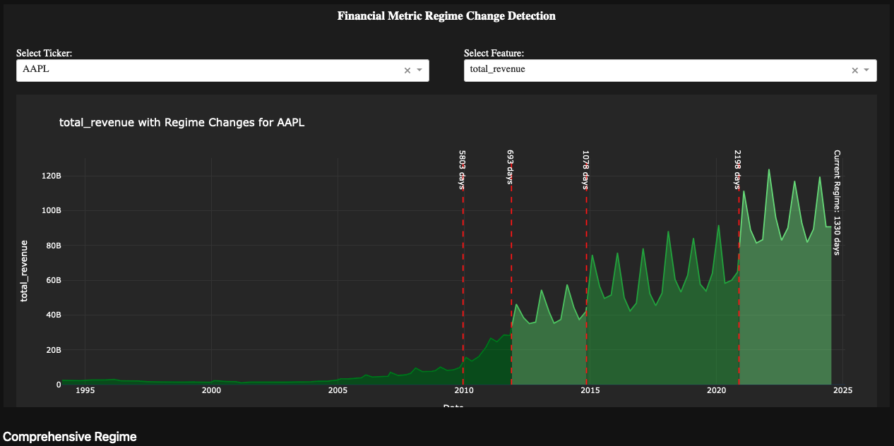
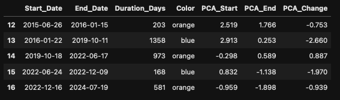
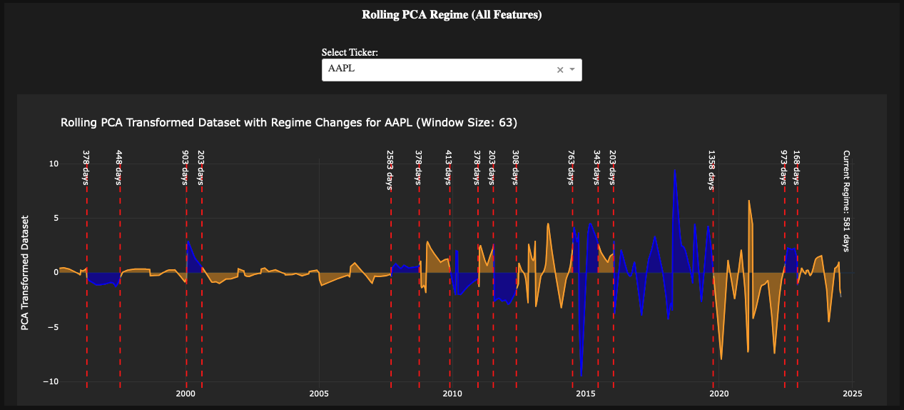

# Time Segmentation

`Tutorials` are the best documentation — [<mark style="color:blue;">`Time Segmentation Tutorial`</mark>](https://colab.research.google.com/github/sovai-research/sovai-public/blob/main/notebooks/computational/Segmentation%20Notebook.ipynb)

### Overview

The Time Segmentation Module is a powerful tool for analyzing financial time series data. It offers four main functionalities:

1. Change Point Detection
2. Regime Change Analysis
3. Comprehensive Regime Analysis (PCA-based)

Each functionality can be used for data analysis or visualization, allowing users to gain deep insights into their financial data.

### Getting Started

To use the Time Segmentation Module, first import the necessary library and authenticate:

```python
import sovai as sov
sov.token_auth(token="your_token_here")
```

```python
df_accounting = sov.data("accounting/weekly").select_stocks("mega")
```

### 1. Change Point Detection

Identify significant changes in your time series data.

#### Data Analysis

```python
df_change = df_accounting.change_point(method='data', feature="book_equity_value")
df_change.tail(10)  # View the last 10 rows
df_change.attrs['stats']  # View additional statistics
```

<figure><figcaption></figcaption></figure>

#### Visualization

```python
df_accounting.change_point(method='plot')
```

<figure><figcaption></figcaption></figure>

### 2. Regime Change Analysis

Detect regime changes for a specific stock and feature.

#### Data Analysis

```python
rc_result = df_accounting.regime_change(method="data", ticker="AAPL", feature="total_revenue")
rc_result.tail(10)  # View the last 10 rows
rc_result.attrs['stats']  # View additional statistics
```

<figure><figcaption></figcaption></figure>

#### Visualization

```python
df_accounting.regime_change(method="plot", ticker="AAPL", feature="total_revenue")
```

<figure><figcaption></figcaption></figure>

### 3. Comprehensive Regime Analysis (PCA-based)

Perform a PCA-based regime change analysis on multiple features for a specific stock.

#### Data Analysis

```python
pca_rc_result = df_accounting.pca_regime_change(method="data", ticker="AAPL")
pca_rc_result.tail()  # View the last rows
pca_rc_result.attrs['stats']  # View additional statistics
```

<figure><figcaption></figcaption></figure>

#### Visualization

```python
df_accounting.pca_regime_change(method="plot", ticker="AAPL")
```

<figure><figcaption></figcaption></figure>

### Tips for Users

* Always check the `.attrs['stats']` of the result for additional insights and metadata.
* Use the 'plot' method for quick visual analysis and the 'data' method for detailed numerical results.
* Experiment with different features and tickers to gain comprehensive insights into your financial data.

***
